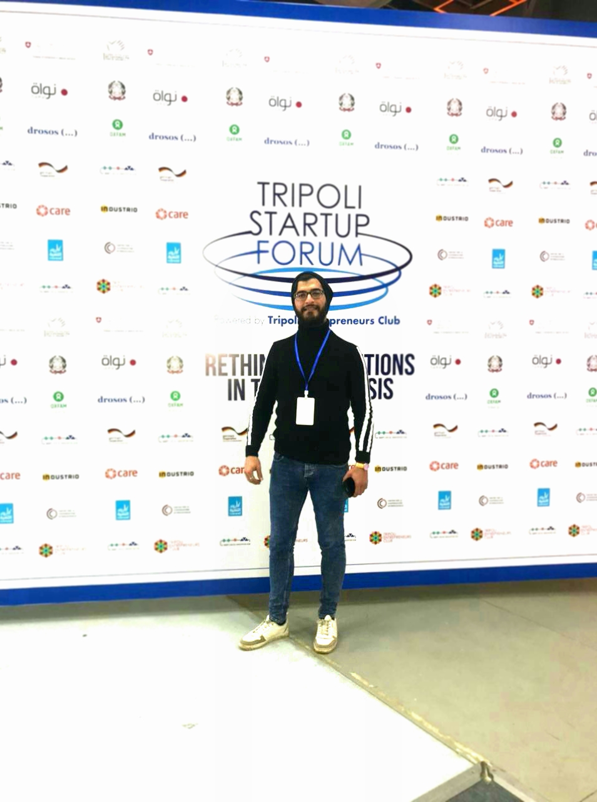

# Khaled mouhy Al Dine Awad

**Location:** Tripoli-Lebanon  
**Email:**  awadkhaled.webdev@gmail.com  
**Telephone:**  +961 03 138 537
**GitHub:** github.com/khaledawadi11454
**LinkedIn:** www.linkedin.com/in/khaledawadi11454 

# Objectives

Junior Web Developer specializing in front end development. Experienced with all stages of the development cycle for dynamic web projects. Well-versed in numerous programming languages including HTML5, JavaScript, CSS3; knowledge PHP, MySQL. Strong background in customer relations.

# Education
**2013 - 2016**   Life science baccalaureate, high school of kobbeh.
**2016 – 2019**   TS2 administrator computing and programing, technical institute of der-Amar.
**2019-2020**     LT licence certificate technical administrator computing and programing

# RELEVANT EXPERIENCE (*INTERNSHIPS*)

`**Web Developer - 2020**`
**Freelancing Web Design, Lebanon**
• Cooperate with designers to create clean interfaces and simple, intuitive interactions and experiences. 
• Develop project concepts and maintain optimal workflow. 
• Complete detailed programming and development tasks for front end public and internal websites as well as challenging back-end server code. 
• Carry out quality assurance tests to discover errors and optimize usability.
`**Full Stack Developer – 2022**`
With Codi tech Program (6 months) in process
`**Supervisor – 2022**`
LRI Association ,Tripoli

# Languages and Skills 

**Languages:**
•	Arabic: Proficiency (Read, Spoken, Written)
•	English: intermediate (Read, Spoken, Written)
•	French: intermediate (Read, Spoken, Written)

**Skills Highlight:**
• Project management
• Strong decision maker 
• Complex problem solver 
• Creative design 
• Innovative 
• Service-focused

# Certificates and Volunteering Experience

•	APP inventor (certificate): **Glow Centre.** 
•	Programming Languages: **JavaScript, HTML5, CSS3.** 
• 	Mindest readiness and career guidance(certificate): **PROABLED Association.** 
• 	TOT course within OXFOM project: **RDFL Association.**
•	IT Support certification: **Coursera with Google.**
